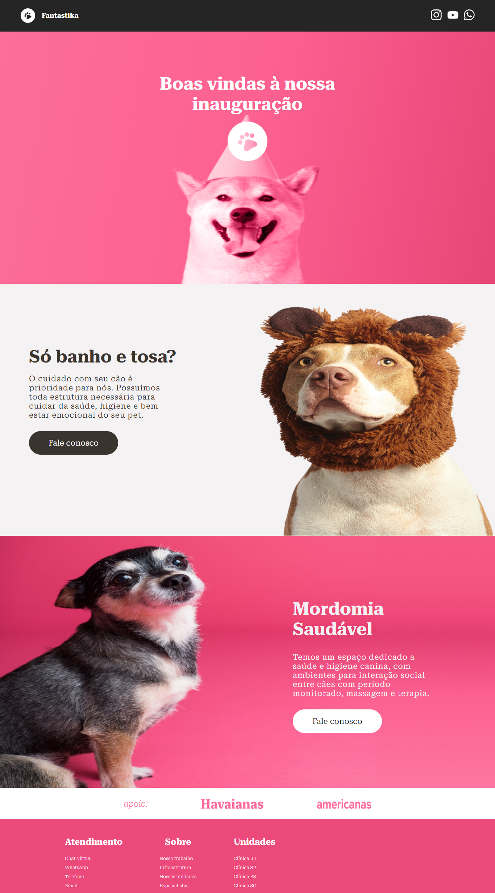

<h1 align="center">
  🐾 Fantastika Responsivo
</h1>

Essa é uma página de um PetShop chamada Fantastika!Aqui, cuidamos dos seus amigos peludos com muito amor e dedicação. A Fantastika foi o desafio final do Módulo 1. Este desafio tinha como objetivo principal a clonagem de um design desenvolvido pelos instrutores do Vai na Web. Este projeto foi disponibilizado no Adobe para que fosse desenvolvido a parte mobile e web.
Neste projeto foi possível ultilizar os conhecimentos em HTML e CSS adquiridos ao longo do módulo.

---

---

## Para o desenvolvimento deste site utilizei as seguintes tecnologias:
- HTML
- CSS
- Adobe xd
- GIT e Github

---

## 🔖 Layout

Você pode visualizar o layout do projeto através [Do link](https://xd.adobe.com/view/c20d8ff9-baf0-4a06-b200-3ffde9c66040-975e/screen/af5cc547-c866-4eef-a092-487cd6f6c6aa/?authuser=0).